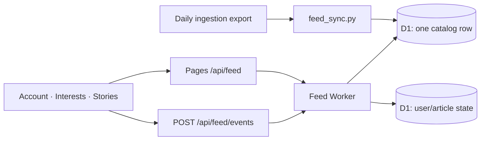

# Personal feed: implemented architecture

Deployed on 2026-10-02. Production page, authenticated-route requirements, and the 2,884-story D1 catalog verified. Pages deployment: https://26d97bd6.hackeratlas.pages.dev. Live site: https://hackeratlas.com/for-you/.

The previous four-table proposal is reduced to two additions: one bounded JSON
catalog row in D1, and one state row per user/canonical article. No public feed
JSON is produced or downloaded. Authentication, topic preferences, and profile
deletion reuse the existing email/profile system and D1 database.

## Serving

`functions/api/feed/[[path]].js` forwards same-origin requests through the private
`FEED` binding to `workers/feed/worker.mjs`. The Worker authenticates the cookie
using the existing reader helpers and reads D1 through a primary session.

`GET /api/feed` returns `{items, topics, updated_at, next_cursor, caught_up}`.
A profile without topics returns `topics_required`. Expired sessions return 401.
Personal responses are private/no-store.

The Worker ranks matching candidates using log HN popularity and a three-day
age decay, deduplicates canonical article keys, excludes persisted seen keys,
and returns up to 20 items. There is no fixed 60-story cap. The finite recent
candidate pool, Show more, and caught-up/Explore ending remain.

The cursor identifies catalog edition, topic-profile version, and the last story
in the stable unfiltered ranking. Seen writes cannot shift that anchor. A changed
catalog or topic version returns 409 and the client starts a new feed. No cursor
state or individual recommendation snapshots are stored in D1.

## Reading state

`feed_story_state(user_id, article_key, seen_at, opened_at)` is keyed by user and
a SHA-256 digest of the existing canonical article-key rule. Another HN submission
of the same article is suppressed too. State is independent of catalog rows.

`POST /api/feed/events` accepts at most 20 `{article_key, type}` entries. Types are
`visible` and `article_opened`. The Worker validates payload shape, same origin,
session and rate limits, then commits idempotent UPSERTs before acknowledging.
Seen timestamps refresh on repeated activity; the first opened timestamp is kept.
These are self-reported interest signals, not authoritative votes or proof of reading.

The browser marks half-visible cards after one continuous second in an active
tab. Clicking a headline immediately records opened and seen, while the article
opens in a new tab. Downloading a page does not count as seen. Visible cards stay
in place; subsequent requests exclude their persisted state.

Unacknowledged events are stored in a bounded account-ID-scoped local queue,
replayed before fetching the feed, and flushed on tab/page exit. Queue entries
expire after 90 days and are cleared on logout or profile deletion. The queue
bridges network failures; cross-device exclusion is guaranteed only after the
server acknowledges the write. Errors do not prevent article navigation.

State is retained for 90 days and cascades on account deletion. Very old reposts
can reappear after retention expires. Clicks are available for later personalization;
the current ranking uses topics and HN freshness/popularity.

## Ingestion and rollout

`feed_sync.py` reuses candidate selection from the ingestion snapshot: up to 20
picks per topic from the last 30 days. It reduces that budget if needed to keep
the private catalog below 1.5 MB. It validates/builds the entire payload before
one parameterized D1 UPSERT switches the active catalog atomically. A failed
write leaves the previous catalog available. No edition or membership tables,
extra cron, public feed artifact, or queue service is needed.

The existing daily deployment applies migrations, checks the bundle, syncs the
catalog, deploys the Feed Worker, and deploys Pages. Public Explore and UI-only
snapshot rebuilds remain static; UI rebuilds themselves have no D1 write effects.

Legacy visibility/open events are backfilled for story IDs present in a synced
catalog. Their old tables are retained temporarily for recovery and expire through
maintenance; new requests never depend on them. Events lost before reaching D1
cannot be recovered.

The feed frontend has only Account and Interests above its stories. There are
no Saved/Hide controls, voting buttons, embedded reader, hero text, or update line.

`scripts/preview_feed.mjs` starts real Pages and Feed Workers sharing persistent
local D1. Profile seeding preserves existing topics/history. See README for setup.

## Interests search

The picker searches names immediately, then requests authenticated
`POST /api/search/topics` after a 350 ms pause. The endpoint combines lexical
matches and cosine similarity against embeddings of topic names and descriptions,
using reciprocal-rank fusion with direct name matches first. It reuses the
existing `text-embedding-3-small` 512-dimensional query embedding helper. Topic
vectors are cached for seven days with a fingerprint of their text; simultaneous
cache misses share one request. The endpoint validates origin/input and limits
requests per account. No additional schema, index, or ingestion job is required.

Draft selections survive changes of query. Clearing/closing the picker cancels
pending requests; responses to older queries are ignored. Semantic outages show
name matches with a short notice. The browser never receives vectors or API keys.
This addition is implemented locally; it has not been included in the production
deployment recorded above.
